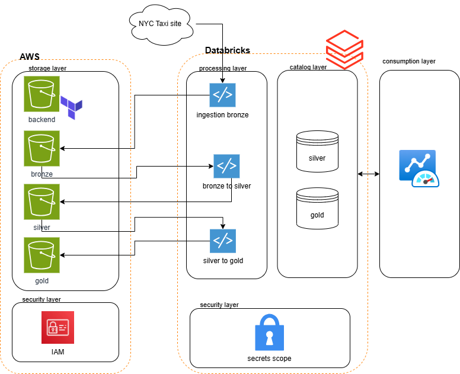

# 🚕 NYC Taxi Data Lake – Medallion Architecture (AWS + Databricks)

### 📌 Visão Geral
Este projeto implementa uma solução end-to-end de Data Lake moderno com arquitetura Medalhão (Bronze, Silver e Gold) utilizando:
* AWS S3 como storage desacoplado
* Databricks Community Edition como engine de processamento
* Terraform para provisionamento de infraestrutura
* PySpark + Python + SQL para processamento e análise
* Databricks Jobs (UI) para orquestração do pipeline

Os dados utilizados são provenientes da NYC Taxi & Limousine Commission.

Obs.: Esta é minha primeira experiência com Databricks

---

## 🧠 Arquitetura da Solução

---

## 🏗️ Camadas do Data Lake

### 🥉 Bronze (Raw Layer)
* Dados ingeridos diretamente do site da NYC TLC
* Armazenados no S3 sem transformação
* Formato original preservado

### 🥈 Silver (Refined Layer)
* Dados limpos e padronizados
* Processamento realizado com PySpark
* Tratamento de inconsistências de schema entre arquivos

#### ⚠️ Particularidade técnica
Os dados são processados arquivo por arquivo, pois existem:
* Diferenças de tipos entre arquivos
* Variações de nomes de colunas (case sensitivity)
* Estruturas inconsistentes

### 🥇 Gold (Consumption Layer)
A camada Gold é a camada de consumo analítico, estruturada em:

#### 📊 Star Schema
* Tabela fato de corridas
* Dimensões relacionadas

#### ⚡ Flat Fact Table
* Estrutura desnormalizada (com dimensões degeneradas)
* Otimizada para consultas rápidas
* Evita joins complexos

---

### 📌 Camada de Consumo (Data Serving Layer)
A camada Gold representa a camada oficial de consumo de dados pelos usuários finais.

Os dados são expostos via:
* Unity Catalog (workspace.gold-nyc-taxi-case)
* External Tables no S3
* SQL diretamente no Databricks

#### 👥 Como os usuários consomem os dados
Os consumidores podem acessar os dados através de:
* SQL no Databricks (notebooks ou editor SQL)
* Queries diretas no schema gold-nyc-taxi-case
* Flat fact table para análises rápidas sem joins
* Star schema para análises dimensionais

Isso permite que:
* Analistas usem SQL puro
* Cientistas de dados façam exploração sem transformação adicional
* Ferramentas BI possam se conectar via JDBC/ODBC (conceitualmente)

---

### 📌 Garantia de Requisitos do Dataset
A camada Silver garante a presença e padronização das colunas obrigatórias:
* VendorID
* passenger_count
* total_amount
* tpep_pickup_datetime
* tpep_dropoff_datetime

---

## ⚙️ Orquestração do Pipeline (Databricks Job)
Foi criado um Databricks Job via UI (interface gráfica) que executa todo o pipeline. O código YML gerado pelo próprio Databricks você encontra em /src/job_main_data_lake.yml:

#### 🔄 Etapas do Job:
1. Ingestão (Bronze)
2. Processamento Bronze → Silver
3. Modelagem Silver → Gold
4. Publicação das tabelas de consumo

#### ⚠️ Observação importante
O Job foi criado via UI do Databricks, e não via Terraform, por dois motivos:
* Limitação da versão Community Edition (pelo menos foi o que eu li)
* Terraform focado apenas na infraestrutura (S3, external locations, catalog, schemas)
* Objetivo do projeto é demonstrar capacidade funcional do pipeline e não apenas IaC

---

## 🏗️ Infraestrutura

### AWS
* S3 Buckets:
    * bronze
    * silver
    * gold
    * terraform backend
* DynamoDB:
    * State lock do Terraform

### Databricks
* Workspace padrão
* Unity Catalog (workspace)
* Schemas:
    * silver
    * gold
* External Locations conectando S3 ↔ Databricks

---

## 🔐 Segurança
Para simplificação do ambiente de desafio:
* Credenciais AWS injetadas via Terraform variables (nunca faria isso em ambiente produtivo)
* Databricks Secrets utilizados no código Python

> ⚠️ Em ambientes produtivos:
> * "AWS Secrets Manager ou Databricks Secret Scope seriam utilizados"

---

## ⚙️ Pipeline de Dados

### 1. Ingestão (Bronze)
* Python + PySpark
* Download direto do site da NYC TLC
* Upload para S3 via boto3

#### ❌ Limitações técnicas encontradas
| Tentativa | Resultado |
| :--- | :--- |
| spark.read(url) | ❌ Não suportado |
| /tmp filesystem | ❌ Bloqueado |
| /dbfs access | ❌ Restrito |

✅ Solução adotada:
* Uso de boto3 com credenciais seguras

### 2. Bronze → Silver
* Leitura arquivo por arquivo
* Normalização de schema
* Padronização de tipos

### 3. Silver → Gold
* Modelagem dimensional
* Criação de Star Schema

### 4. Flat Fact Table
* Estrutura desnormalizada
* Otimizada para consumo direto

---

## 📊 Análises (SQL)
As seguintes perguntas foram respondidas:

1. Média mensal de total_amount
2. Média de passenger_count por hora (Maio)

Scripts disponíveis em: /analytics

---

## 🔄 Fluxo End-to-End
1. Extração dos dados (NYC TLC)
2. Armazenamento na Bronze (S3)
3. Processamento e limpeza (Silver)
4. Modelagem analítica (Gold)
5. Publicação da camada de consumo
6. Acesso via SQL pelos usuários finais

---

## 📄 Estrutura do Projeto
000-buckets/
100-databricks/

src/
  bronze/
  silver/
  gold/

analytics/

README.md
requirements.txt
.gitignore

---

## 🚀 Como Executar

### 0. Premissas
Conta na AWS e Databricks Community
Terraform instalado
AWS CLI configurado (aws configure)
Permissões para criar:
* S3
* IAM Role
* IAM Policy
* DynamoDB
* PAT (Personal Access Token) no Databricks para realizar a integração External Location -> Bucket S3
 Ao clonar projeto, editar o terraform.tfvars que está em 100-databricks inserindo Access Key, Secret Access Key de sua conta AWS. Inserir também a URL (domínio) de sua conta Databricks e seu PAT. Este passo é necessário para criar o secrets scope e external locations no Databricks que vai garantir que o boto3 possa acessar e escrever dados no S3, assim como o Catalog possa visualizar as external tables. Este arquivo não deve ser versionado.

 Criar a integração do Git e Databricks. Etapa importante que disponibiliza tanto o código de processamento de dados, quanto as consultas SQL no ambiente Databricks.

### 1. Infraestrutura
terraform init
terraform apply

### 2. Pipeline
Executar Job Databricks ou rodar os scripts:
1. ingestion_bronze.py
2. bronze_to_silver.py
3. silver_to_gold.py

### 3. Consumo
Executar SQL no Databricks:
* schema: workspace.gold-nyc-taxi-case

---

## 🎯 Decisões Arquiteturais

### 📦 S3 como storage
* Desacoplamento total
* Evita lock-in

### 🧠 Medallion Architecture
* Separação clara de responsabilidades
* Governança e escalabilidade

### 📊 Star Schema
* Otimizado para analytics
* Padrão de mercado

### ⚡ Flat Fact Table
* Reduz joins
* Melhora performance
* Facilita consumo por usuários não técnicos

---

## 🧩 Observação Final
Este projeto foi construído em ambiente Databricks Community Edition + AWS S3, com:
* Pipeline completo de engenharia de dados
* Camada de consumo via SQL
* Orquestração via Databricks Job
* Infraestrutura como código com Terraform